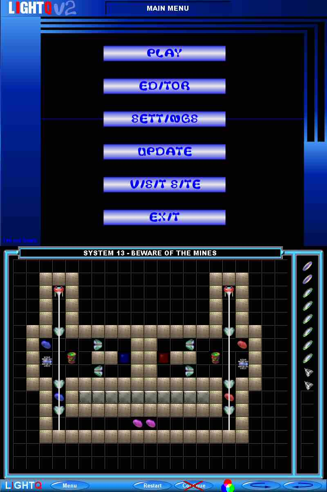



## LightQ Version 2

### Description

LightQ is a game of mirrors, light and IQ ! it's a logic puzzle game that will proof your knowledge of merging light and reflections. The goal is to get all coins spin by sending a beam of light of the same color over it. This is a COMPLETE game with menu, sounds, music, intro, players, levelpack, editor (for making your own puzzles) and more ! you need the DirectX 8.0 type library (for sound). Further this code is based on the windows GDI32 DLL. In future i will convert it to pure directx for more platform support. Please let me know incorrect code behaviour. For now check it and have a lot of fun playing this game!!!
 
### More Info
 
mouse, keyboard

I tested it on a Pentium II 350 Mhz with 128 MB, WinME, it was very slow. I tested it on a AMD Athlon XP 2400+, 512 MB, WinXP, it runs superb !!!

directx 8.0 type library on system for sound, uses GDI32.DLL for drawing

             |
---                |---
**Submitted On**   |2004-04-02 15:47:24
**By**             |[TPD Software](https://github.com/Planet-Source-Code/PSCIndex/blob/master/ByAuthor/tpd-software.md)
**Level**          |Intermediate
**User Rating**    |4.9 (78 globes from 16 users)
**Compatibility**  |VB 5\.0, VB 6\.0
**Category**       |[Games](https://github.com/Planet-Source-Code/PSCIndex/blob/master/ByCategory/games__1-38.md)
**World**          |[Visual Basic](https://github.com/Planet-Source-Code/PSCIndex/blob/master/ByWorld/visual-basic.md)
**Archive File**   |[LightQ\_Ver172771422004\.zip](https://github.com/Planet-Source-Code/tpd-software-lightq-version-2__1-52815/archive/master.zip)

